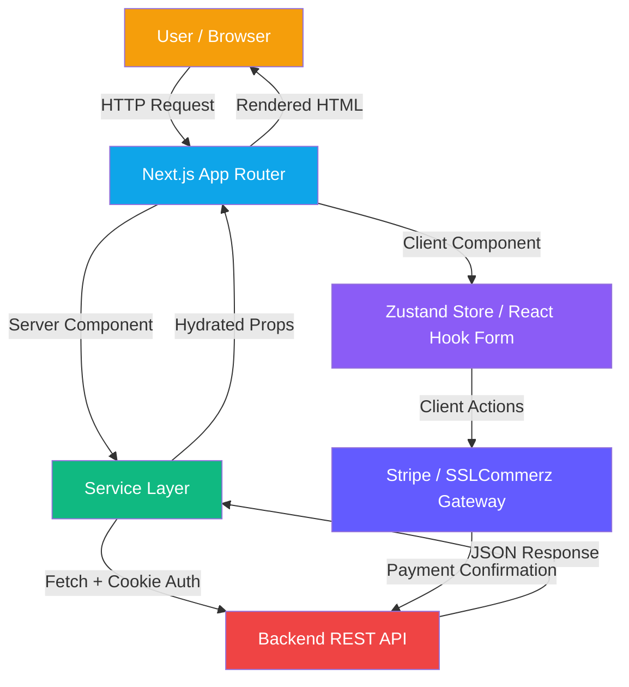
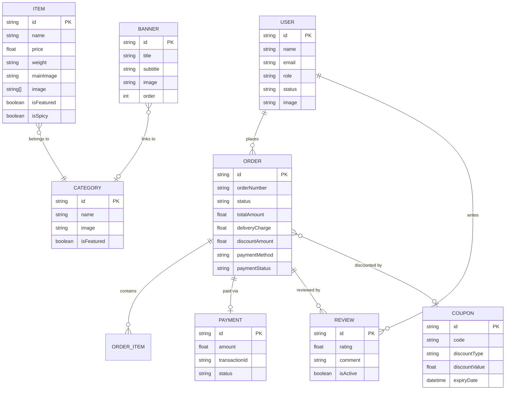

# 🍿 Urban Snacks Client

[](https://nextjs.org/)
[](https://tailwindcss.com/)
[](https://www.typescriptlang.org/)
[](https://better-auth.com/)
[](https://www.framer.com/motion/)
[](https://stripe.com/)
[](https://zustand-demo.pmnd.rs/)
[](https://ui.shadcn.com/)

Urban Snacks is a modern, premium **platform for authentic Bangladeshi snacks**. This repository contains the **Frontend Client**, built for visual excellence, buttery-smooth interactions, and a complete shopping experience — from discovery to doorstep delivery. Features a full-featured admin dashboard with analytics, inventory management, and order processing.

---

## Backend Repository

[Backend Repository](https://github.com/sayed725/urban_snacks_server)

## 📖 Table of Contents

1. [Technical Architecture](#️-technical-architecture)
2. [Feature Ecosystem](#-feature-ecosystem)
3. [User Personas & Journeys](#-user-personas--journeys)
4. [Data Flow Diagram](#-data-flow-diagram)
5. [Core Development Principles](#️-core-development-principles)
6. [Folder Architecture](#-folder-architecture)
7. [Setup & Configuration](#-setup--configuration)
8. [Key API Integrations](#-key-api-integrations)

---

## 🏗️ Technical Architecture

The application is architected using a **Modular Component Design** approach, leveraging Next.js 16 App Router with route grouping for public storefront and protected admin dashboard — ensuring high maintainability, scalability, and premium UX.

### Core Stack

| Layer | Technology | Purpose |
|---|---|---|
| **Framework** | Next.js 16 (App Router) | SSR, SSG, Server Actions & File-based Routing |
| **Styling** | Tailwind CSS 4 + Shadcn/UI | Premium design system with Radix primitives |
| **Language** | TypeScript 5 | End-to-end type safety |
| **Authentication** | Better Auth | Session-based auth with Google OAuth & role extraction |
| **State** | Zustand | Lightweight client-side state (cart, sidebar) |
| **Data Fetching** | TanStack React Query | Server state, caching, and optimistic updates |
| **Animations** | Framer Motion | Micro-interactions, page transitions & parallax effects |
| **Forms** | React Hook Form + Zod 4 | Validated, schema-driven form handling |
| **Charts** | Recharts | Admin dashboard KPI visualizations |
| **Carousel** | Embla Carousel | Hero slider & image gallery |
| **PDF** | jsPDF + jsPDF-AutoTable | Client-side invoice generation |
| **Payments** | Stripe + SSLCommerz | Dual payment gateway checkout |
| **UI Extras** | Lucide, React Icons, Sonner | Icon system, toast notifications |
| **Image Upload** | ImgBB API | Server-side image hosting via API route |

---

## 🌟 Feature Ecosystem

### 🌐 Public Storefront

- **Dynamic Hero Slider**: Admin-managed banners with category-linked CTAs, auto-play, and smooth crossfade transitions.
- **Featured Products**: Curated snack showcase with animated product cards and quick "Add to Cart" actions.
- **Category Browsing**: Filter products by snack categories (Spicy, Sweet, Savory, etc.) with sidebar navigation.
- **Product Detail Pages**: Multi-image gallery, nutritional info (weight, pack size, spicy indicator), and related product suggestions.
- **How It Works**: Animated step-by-step interactive guide showcasing the ordering journey.
- **Customer Reviews**: Verified purchase reviews displayed on the homepage.
- **Cart Drawer**: Slide-out cart with quantity adjustments, dynamic pricing, and instant checkout access.
- **Policy Pages**: Privacy, Shipping, and Terms & Conditions — fully dark-mode friendly.
- **WhatsApp Integration**: Floating WhatsApp button for instant customer support.
- **SEO Optimized**: Dynamic metadata, semantic HTML, and Open Graph tags for every page.

### 🛒 Shopping Experience

- **Smart Cart**: Zustand-powered persistent cart with add, remove, quantity controls, and real-time total calculation.
- **Checkout Flow**: Multi-step checkout with shipping details, delivery charge calculation (city-based + weight surcharge), and payment selection.
- **Coupon System**: Apply promotional codes at checkout with real-time discount calculation and validation.
- **Triple Payment Options**: Cash on Delivery, Stripe (international cards), and SSLCommerz (bKash, Nagad, local banks).
- **Order Tracking**: Full order lifecycle visibility (`Placed → Processing → Shipped → Delivered`).
- **Invoice Download**: Generate professional PDF invoices with order details, payment status, and itemized breakdown.
- **Order Reviews**: Submit ratings and comments on completed orders.

### 🛡️ Admin Dashboard

- **Analytics Overview**: Real-time KPIs — total revenue, orders, users, items — with 30-day performance charts using Recharts.
- **Item Management**: Full CRUD for snack products with multi-image upload, featured toggles, and category assignment.
- **Category Manager**: Create, update, and delete snack categories with images and featured flags.
- **Order Management**: View all orders, advance status through the fulfillment pipeline, cancel or delete orders, and create manual orders.
- **User Management**: View all registered users, update account status (active/banned/inactive).
- **Banner Manager**: Dynamic hero slider content — create, reorder, and link banners to categories.
- **Coupon Manager**: Create and manage promotional codes with discount rules, usage limits, and expiry dates.
- **Review Moderation**: Approve, reject, or delete customer reviews before they appear publicly.
- **Reusable Pagination**: Smart ellipsis pagination component across all data tables.

---

## 👥 User Personas & Journeys

### 1. The Shopper Flow

```
Discover → Browse Snacks → View Details → Add to Cart → Checkout → Pay → Track → Review
```

- Uses the **Hero Slider** and **Featured Products** section to discover new snacks.
- Uses **Category Filters** to narrow down by taste preference.
- Uses the **Cart Drawer** for quick review and the **Checkout Page** for address, coupon, and payment.
- Uses **My Orders** to track delivery status and **Download Invoice** for records.
- Submits a **Review** after receiving the order.

### 2. The Admin Flow

```
Login → Dashboard Analytics → Manage Inventory → Process Orders → Moderate Reviews → Configure Promotions
```

- Uses the **Analytics Dashboard** to monitor revenue trends and order volume.
- Uses **Item Management** to add new products with images and pricing.
- Uses the **Order Pipeline** to advance orders through processing, shipping, and delivery.
- Uses **Coupon Manager** to create seasonal promotions and discounts.
- Uses **Banner Manager** to update the hero slider with new campaigns.

---

## 📊 Data Flow Diagram



### Entity Relationship Overview



---

## 🛠️ Core Development Principles

1. **Strict Typing**: Full TypeScript coverage across all service functions, API responses, Zod schemas, and component props.
2. **Server-First Data Fetching**: Service functions execute on the server, forwarding cookies directly to the backend — no token exposure on the client.
3. **Visual Excellence**: Premium UI built with Shadcn/UI components, Framer Motion animations, and a custom design system with oklch color tokens, softened typography, and full dark mode support.
4. **Performance First**:
   - Next.js Image optimization with `sharp` for all product images.
   - `no-store` cache on authenticated fetches to guarantee fresh data.
   - Embla Carousel for smooth hero slider transitions.
   - Zustand for lightweight, zero-boilerplate client state.
5. **Security**:
   - Session forwarding via `next/headers` cookies — no client-side token exposure.
   - Role-based route protection via layout-level guards in the dashboard.
   - All mutations require valid session cookies propagated from the server.
   - ImgBB API key kept server-side via Next.js API route (no `NEXT_PUBLIC_` prefix).

---

## 📂 Folder Architecture

```text
src/
├── app/                              # Next.js App Router
│   ├── (commonLayout)/               # Public storefront routes
│   │   ├── page.tsx                  # Homepage (hero, features, products)
│   │   ├── products/                 # Product listing & detail pages
│   │   │   └── [id]/                 # Dynamic product detail page
│   │   ├── cart/                     # Cart page
│   │   ├── checkout/                 # Checkout flow
│   │   ├── my-orders/                # User's order history
│   │   ├── payment/                  # Payment success/failure pages
│   │   ├── privacy-policy/           # Privacy policy page
│   │   ├── shipping-policy/          # Shipping policy page
│   │   ├── terms-conditions/         # Terms & conditions page
│   │   └── (auth)/                   # Login & register pages
│   ├── (dashboardLayout)/            # Protected admin dashboard
│   │   └── dashboard/admin/          # Admin panel
│   │       ├── page.tsx              # Analytics overview
│   │       ├── items/                # Item CRUD management
│   │       ├── categories/           # Category management
│   │       ├── orders/               # Order processing pipeline
│   │       ├── users/                # User management
│   │       ├── banners/              # Hero banner management
│   │       ├── coupons/              # Coupon management
│   │       └── reviews/              # Review moderation
│   ├── api/                          # Next.js API routes (ImgBB proxy, auth)
│   └── not-found.tsx                 # Custom 404 page
├── components/
│   ├── ui/                           # Shadcn base components (40+ components)
│   ├── shared/                       # App-wide shared components
│   │   ├── Navbar3.tsx               # Responsive mega navigation
│   │   ├── Footer.tsx                # Site-wide footer
│   │   ├── CartDrawer.tsx            # Slide-out cart panel
│   │   ├── ProductCard.tsx           # Reusable product card
│   │   ├── SectionHeader.tsx         # Gradient section headings
│   │   ├── USPagination.tsx          # Smart pagination component
│   │   ├── WhatsAppButton.tsx        # Floating WhatsApp CTA
│   │   └── form/                     # Shared form field components
│   ├── modules/                      # Page-level feature modules
│   │   ├── home/                     # HeroSlider, FeatureCard, HowItWorks, categories, reviews
│   │   ├── products/                 # Products sidebar, filters
│   │   ├── admin/                    # Admin dashboard components (items, orders, banners, coupons)
│   │   ├── user/                     # User order & review components
│   │   └── Auth/                     # Login & register forms
│   └── layout/                       # Sidebar navigation (dashboard)
├── services/                         # Server-side API service layer
│   ├── item.service.ts               # Product CRUD operations
│   ├── order.service.ts              # Order lifecycle management
│   ├── payment.service.ts            # Stripe & SSLCommerz session creation
│   ├── category.service.ts           # Category management
│   ├── review.service.ts             # Review submission & moderation
│   ├── coupon.service.ts             # Coupon verification & CRUD
│   ├── banner.service.ts             # Banner management
│   ├── user.service.ts               # User session & profile
│   ├── userAll.service.ts            # Admin user listing
│   └── stats.service.ts              # Dashboard analytics data
├── store/                            # Zustand state stores
│   ├── cart.store.ts                 # Shopping cart state & persistence
│   └── sidebar.store.ts             # Dashboard sidebar toggle
├── actions/                          # Next.js Server Actions
├── hooks/                            # Custom React hooks
├── lib/                              # Auth client, utilities
├── providers/                        # Theme, Query providers
├── config/                           # Environment config (t3-env)
├── features/                         # Feature-specific logic
├── types/                            # Global TypeScript interfaces
├── zod/                              # Zod validation schemas
└── proxy.ts                          # API proxy utility for server-side fetches
```

---

## 🚀 Setup & Configuration

### Prerequisites

- **Node.js** v18+
- **npm** or **pnpm**
- A running instance of the [Urban Snacks Server](https://github.com/sayed725/urban_snacks_server)

### Installation

```bash
# Clone the project
git clone https://github.com/sayed725/urban_snacks_client

# Enter the directory
cd urban_snacks_client

# Install dependencies
npm install
```

### Environment Variables

Create a `.env` file in the root directory:

```env
# Environment
NEXT_PUBLIC_NODE_ENV=development

# API URLs
NEXT_PUBLIC_BACKEND_URL="http://localhost:5001"
NEXT_PUBLIC_FRONTEND_URL="http://localhost:3000"
NEXT_PUBLIC_API_URL="http://localhost:5001/api/v1"
NEXT_PUBLIC_AUTH_URL="http://localhost:3000/api/auth"

# Google OAuth
NEXT_PUBLIC_GOOGLE_CLIENT_ID="your_google_client_id"
NEXT_PUBLIC_GOOGLE_CLIENT_SECRET="your_google_client_secret"
NEXT_PUBLIC_GOOGLE_CALLBACK_URL="your_callback_url"

# ImgBB (server-only — no NEXT_PUBLIC_ prefix)
IMGBB_API_KEY="your_imgbb_api_key"
```

> ⚠️ **Important**: `NEXT_PUBLIC_BACKEND_URL` must match the running Urban Snacks Server URL. `IMGBB_API_KEY` is intentionally kept without a `NEXT_PUBLIC_` prefix for security.

### Development Server

```bash
npm run dev
```

The app will be available at **`http://localhost:3000`**.

### Production Build

```bash
npm run build
npm run start
```

---

## 📄 Key API Integrations

All API calls are encapsulated in the **server-side service layer** located in `src/services/`. They use a custom `proxy.ts` utility for secure cookie forwarding.

| Service | File | Key Operations |
|---|---|---|
| **Item** | `item.service.ts` | `getAllItems`, `getItemById`, `createItem`, `updateItem`, `deleteItem` |
| **Order** | `order.service.ts` | `createOrder`, `getAllOrders`, `getUserOrders`, `getOrderById`, `cancelOrder`, `changeOrderStatus`, `deleteOrder` |
| **Payment** | `payment.service.ts` | `createCheckoutSession` (Stripe), `initiateSSL` (SSLCommerz) |
| **Category** | `category.service.ts` | `getAllCategories`, `createCategory`, `updateCategory`, `deleteCategory` |
| **Review** | `review.service.ts` | `createReview`, `getAllReviews`, `updateReviewStatus`, `deleteReview` |
| **Coupon** | `coupon.service.ts` | `verifyCoupon`, `createCoupon`, `getCoupons`, `updateCoupon`, `deleteCoupon` |
| **Banner** | `banner.service.ts` | `getBanners`, `createBanner`, `updateBanner`, `deleteBanner` |
| **User** | `user.service.ts` | `getSession`, `updateUser`, `getAllUsers`, `updateUserStatus` |
| **Stats** | `stats.service.ts` | `getAdminStats` |

### Service Design Patterns

- **Cookie Forwarding**: All authenticated API calls use `next/headers` `cookies()` to securely forward session cookies to the backend — zero client-side token exposure.
- **Proxy Utility**: A centralized `proxy.ts` handles base URL resolution, header injection, and error normalization for all outbound requests.
- **No-Store Caching**: All authenticated and mutable endpoints use `cache: "no-store"` to guarantee fresh data on every render.
- **Schema Validation**: Outbound form data is validated with **Zod 4** schemas before submission via React Hook Form's `@hookform/resolvers`.
- **Optimistic UI**: TanStack React Query powers cache invalidation and background refetching for seamless data updates.

---

**Built with 🧡 for the love of authentic Bangladeshi snacks.**
